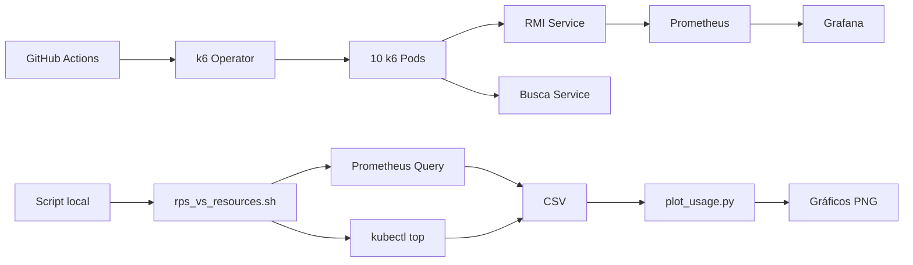
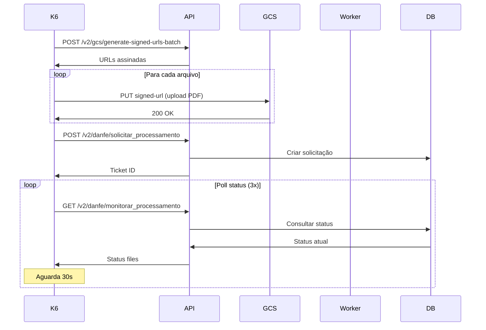
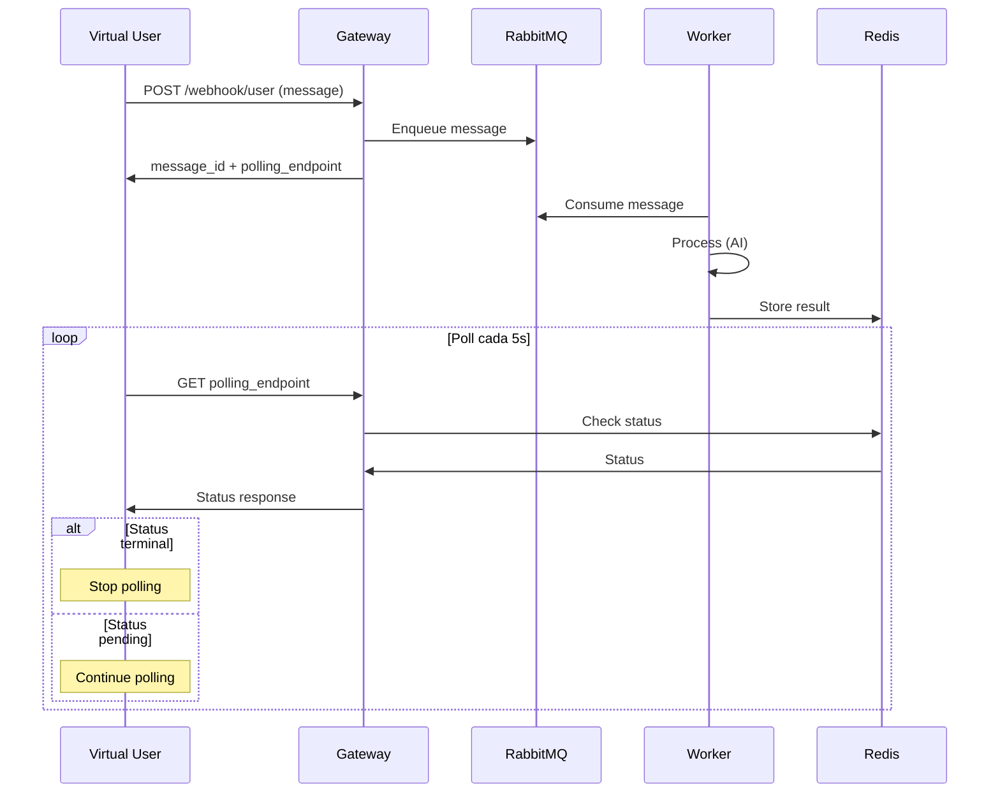
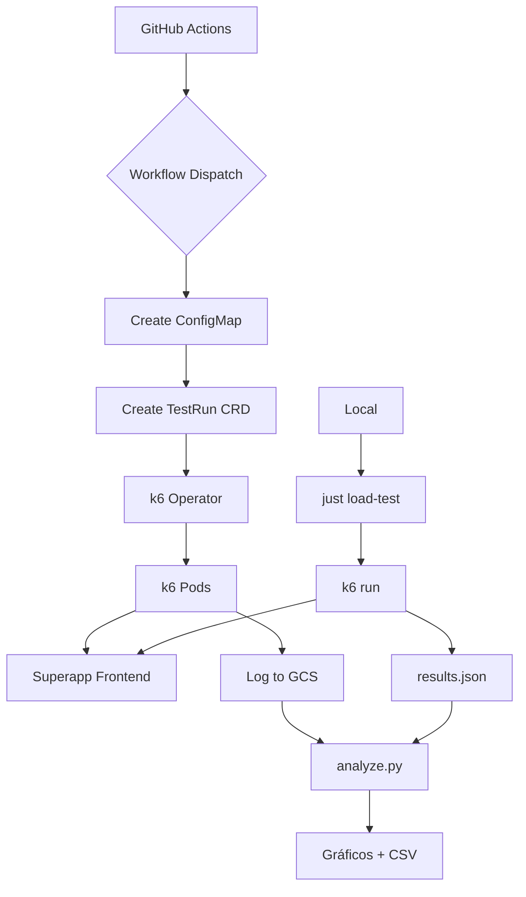
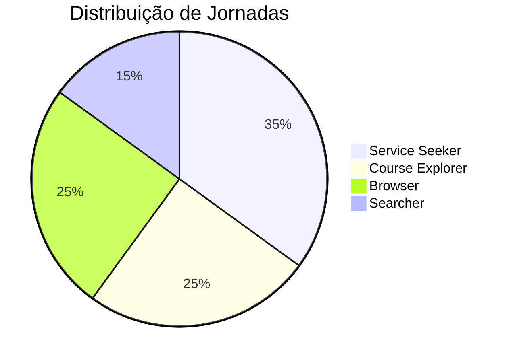
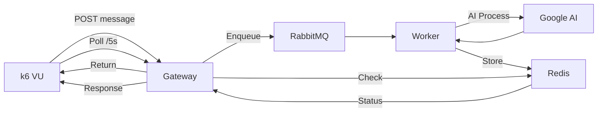

# Análise de Uso do k6 nos Repositórios

Documentação completa sobre a implementação de testes de carga com k6 em 5 repositórios.

---

## 📊 Repositório: app-rmi

### O que é testado

**Serviços:**
- RMI Service (Backend principal): `http://rmi.rmi.svc.cluster.local:80`
- Busca Service (Busca/Descoberta): `http://app-busca-search.busca.svc.cluster.local:8080`

**Endpoints testados:**

*Autenticados (RMI):*
- `/v1/citizen/{cpf}/firstlogin` - Verificar primeiro login
- `/v1/citizen/{cpf}` - Informações do cidadão
- `/v1/citizen/{cpf}/ethnicity` - Atualizar etnia
- `/v1/citizen/{cpf}/phone` - Atualizar telefone
- `/v1/citizen/{cpf}/email` - Atualizar email
- `/v1/citizen/{cpf}/address` - Atualizar endereço
- `/v1/citizen/{cpf}/wallet` - Carteira
- `/v1/citizen/{cpf}/maintenance-request` - Solicitações

*Públicos (Busca):*
- `/api/v1/categorias-relevancia` - Categorias por relevância
- `/api/v1/categoria/{collections}` - Serviços por categoria
- `/api/v1/busca-hibrida-multi` - Busca híbrida

### Como é testado

**8 Cenários principais:**

1. **Mixed** (padrão): Todos os cenários simultaneamente
2. **First Login**: Onboarding de novos usuários
3. **Home Dashboard**: Carregamento da página inicial
4. **Personal Info**: Atualização de perfil
5. **Wallet Cards**: Interação com carteira
6. **Category Browsing**: Navegação por categorias
7. **Search**: Busca de serviços
8. **Popular Services**: Serviços populares

**Configuração de carga:**
```javascript
stages: [
  { duration: '5m', target: VUs },   // Ramp-up
  { duration: '10m', target: VUs },  // Sustentado
  { duration: '2m', target: 0 }      // Ramp-down
]
```

### Métricas coletadas

**Métricas customizadas:**
- `failed_requests` - Taxa de falhas HTTP
- `http_failures` - Falhas detalhadas (5xx)
- `check_failures` - Problemas de qualidade

**Thresholds:**
- P95 < 5000ms
- Taxa de erro < 5%
- Check failures < 15%

**Destino:** Logs do k6 (stdout), GitHub Actions summary

### Scripts de análise

**Coleta de métricas:**
```bash
# Script: scripts/resource_utilisation/rps_vs_resources.sh
# Coleta: RPS (Istio), CPU, Memória
# Output: rmi_usage_YYYYMMDD_HHMMSS.csv
```

**Geração de gráficos:**
```bash
# Script: scripts/resource_utilisation/plot_usage.py
# Gera: 3 painéis (RPS, CPU, Memória)
# Output: {csv_name}_plot.png
```

### Como executar

**Método 1: Kubernetes (GKE) - Produção**
```bash
# Via GitHub Actions workflow: .github/workflows/run-load-tests.yaml
# Trigger: Manual
# k6 Operator com 10 pods paralelos
```

**Método 2: Local com Just**
```bash
just load-test <base_url> <cpf_csv> <token_file> <oauth_config>
```

**Método 3: k6 direto**
```bash
export KEYCLOAK_ISSUER=https://auth.example.com/realms/realm
export KEYCLOAK_CLIENT_ID=client-id
export KEYCLOAK_CLIENT_SECRET=secret
k6 run k6/load_test.js
```

### Variáveis de ambiente

```bash
# Autenticação
KEYCLOAK_ISSUER=https://auth-server/realms/realm
KEYCLOAK_CLIENT_ID=client-id
KEYCLOAK_CLIENT_SECRET=secret

# URLs
BASE_URL_RMI=http://rmi.example.com
BASE_URL_BUSCA=http://search.example.com

# Configuração
USER=12345678901              # CPF para teste
TEST_SCENARIO=mixed           # Cenário
VIRTUAL_USERS=10             # Número de VUs
RAMP_UP_DURATION=5m
STEADY_DURATION=10m
RAMP_DOWN_DURATION=2m
```

### Diagramas



---

## 📊 Repositório: danfe-ai

### O que é testado

**API V1 - Processamento Direto:**
- `POST /api/v1/danfe/processar` - Upload e processamento síncrono de PDF

**API V2 - Workflow Assíncrono:**
- `POST /api/v2/gcs/generate-signed-urls-batch` - Gerar URLs assinadas
- `PUT /api/v2/gcs/<signed-url>` - Upload para GCS
- `POST /api/v2/danfe/solicitar_processamento` - Solicitar processamento
- `GET /api/v2/danfe/monitorar_processamento` - Monitorar status

### Como é testado

**Cenário principal:** `high_volume_single_session`
- 1500 VUs concorrentes
- 1 iteração por VU
- Timeout de 30 minutos

**Fluxo V1:**
1. Seleciona 2-5 PDFs aleatórios
2. Upload e processamento sequencial
3. Aguarda 1-3s entre arquivos

**Fluxo V2:**
1. Seleciona 10 PDFs aleatórios
2. Gera URLs assinadas (batch)
3. Upload para GCS
4. Solicita processamento
5. Monitora status (3 polls × 30s)

### Métricas coletadas

**Métricas customizadas:**
```javascript
danfe_processing_duration       // Tempo de processamento
danfe_success_rate              // Taxa de sucesso
danfe_valid_rate                // DANFEs válidas
danfe_invalid_rate              // DANFEs inválidas
danfe_error_rate                // Erros
gcs_upload_duration             // Tempo de upload GCS
gcs_upload_success_rate         // Taxa de sucesso upload
```

**Thresholds:**
- P95 req < 60s
- Taxa de erro < 10%
- P95 processamento < 45s
- Taxa sucesso > 90%
- P95 upload GCS < 10s

**Formato de saída:**
```json
{
  "timestamp": "2025-11-03T17:15:24.709Z",
  "filename": "sample.pdf",
  "request_type": "v2_generate_signed_urls",
  "duration_ms": 239,
  "status_code": 200,
  "danfe_status": "valido"
}
```

### Scripts de análise

**1. Extração de resultados:**
```bash
# Script: scripts/extract-results.py
# Input: k6-output.log
# Output: test-results.json
```

**2. Análise estatística:**
```bash
# Script: scripts/analyze-results.py
# Gera: analysis_report.md + 4 gráficos PNG
```

**3. Geração de relatórios:**
```bash
# Script: scripts/generate-report.py
# Gera: 10+ gráficos + load_test_report.md
```

**Gráficos gerados:**
- `requests_over_time.png` - Requisições ao longo do tempo
- `duration_histogram.png` - Distribuição de tempos
- `success_rate.png` - Taxa de sucesso (pizza)
- `danfe_status_distribution.png` - Status dos DANFEs
- `response_size_distribution.png` - Tamanho das respostas

### Como executar

**VM do GCP (método principal):**
```bash
# 1. Iniciar VM
gcloud compute instances start load-test-danfe --zone us-central1-f

# 2. Gerar token MSAL (local)
cd api && http-server -p 3000
# Abrir http://localhost:3000/tests/msal_token.html

# 3. Atualizar tokens
just refresh-tokens-gcp

# 4. Conectar à VM
gcloud compute ssh load-test-danfe --zone us-central1-f

# 5. Setup
cd danfe-ai && nix develop
source load-testing/.env
source load-testing/config/.env.loadtest

# 6. Executar
just load-test load-testing/config/test-files/

# 7. Analisar
just extract-results
just plot-results

# 8. Copiar resultados
gcloud compute scp --recurse load-test-danfe:~/danfe-ai/load-testing/results ~/Desktop/
```

**Local:**
```bash
just load-test-setup
just load-test /path/to/pdfs
just extract-results
just plot-results
```

### Variáveis de ambiente

```bash
# Configuração principal
API_BASE_URL_V1=https://staging.danfe-ai.dados.rio/api/v1
API_BASE_URL_V2=https://staging.danfe-ai.dados.rio/api/v2
TEST_VERSION=v2
LOAD_TEST_USER_EMAIL=testeappweb@rioeduca.net

# Autenticação
JWT_TOKEN=<token>
REFRESH_TOKEN=<token>
MSAL_ACCESS_TOKEN=<token>
SECRET_KEY=your-secret-key
ALGORITHM=HS256

# Teste
REQUEST_TIMEOUT=180
VERBOSE_LOGGING=true
```

### Diagramas



---

## 📊 Repositório: ai-gateway

### O que é testado

**Endpoint principal:**
- `POST /api/v1/message/webhook/user` - Submissão de mensagem
- `GET {polling_endpoint}` - Polling de status (dinâmico)

**Fluxo completo:**
1. Envio de mensagem → recebe `message_id` + `polling_endpoint`
2. Poll a cada 5s até status terminal (`completed`, `failed`, `error`)

### Como é testado

**Perfil de carga:**
```javascript
stages: [
  { duration: '1m', target: 1500 },  // Ramp-up
  { duration: '3m', target: 1500 },  // Sustentado
  { duration: '1m', target: 0 }      // Ramp-down
]
```

**Comportamento do VU:**
- 3 mensagens por usuário (configurável)
- Primeira: aviso de teste de carga
- Demais: strings aleatórias (75%) ou query Google Search (25%)
- Delay entre mensagens: 10s (configurável)

### Métricas coletadas

**Métricas customizadas:**
```javascript
message_completion_time              // Tempo total até completar
successful_message_completion_time   // Apenas sucessos
failed_message_completion_time       // Apenas falhas
message_success_rate                 // Taxa de sucesso
```

**Thresholds:**
- P95 req < 5s
- Taxa de erro < 10%
- P99 completion < 100s
- Taxa de sucesso > 99%

**Saída:** JSON (NDJSON) em `results.json`

### Scripts de análise

**Script único:** `generate-charts.py`

**Gráficos gerados:**
1. `message_completion_histograms.png` - Grid 2×2:
   - Todas as mensagens
   - Mensagens bem-sucedidas
   - Mensagens com falha
   - Taxa de sucesso (pizza)

2. `detailed_analysis.png`:
   - Comparação de percentis (P50, P95, P99)
   - Box plot de distribuição

3. `summary_report.txt` - Relatório estatístico

### Como executar

**Local via Just:**
```bash
just load-test <bearer-token>
just plot-results
```

**k6 direto:**
```bash
BEARER_TOKEN=<token> \
BASE_URL=https://your-endpoint.com \
MESSAGES_PER_USER=5 \
MESSAGE_DELAY_SECONDS=15 \
LOG_LEVEL=DEBUG \
k6 run --out json=load-tests/results.json load-tests/main.js
```

**Com Nix:**
```bash
nix develop
just load-test $TOKEN
```

### Variáveis de ambiente

```bash
BASE_URL=https://eai-agent-gateway-superapp-staging.squirrel-regulus.ts.net
BEARER_TOKEN=<token>
MESSAGES_PER_USER=3
MESSAGE_DELAY_SECONDS=10
LOG_LEVEL=INFO  # DEBUG, INFO, WARN, ERROR, NONE
```

### Diagramas



---

## 📊 Repositório: superapp

### O que é testado

**4 jornadas de usuário:**

1. **Service Seeker** (35%) - Busca de serviços específicos
2. **Course Explorer** (25%) - Exploração de cursos
3. **Browser** (25%) - Navegação geral
4. **Searcher** (15%) - Busca intensiva

**Endpoints por jornada:**

*Service Seeker:*
- `/` - Home
- `/servicos` - Listagem
- `/servicos/categoria/{category}/{id}/{collection}` - Detalhes
- `/api/search?q={query}` - Busca

*Course Explorer:*
- `/servicos/cursos` - Cursos
- `/servicos/cursos/busca` - Busca de cursos
- `/servicos/cursos/meus-cursos` - Meus cursos

*Browser:*
- `/servicos/categoria/{category}` - Categorias
- `/faq` - FAQ
- `/ouvidoria` - Ouvidoria

*Searcher:*
- `/busca` - Busca
- `/api/search?q={query}` - Múltiplas queries

### Como é testado

**Perfil de carga (21 minutos):**
```javascript
[
  { duration: '2m', target: 50 },
  { duration: '5m', target: 50 },
  { duration: '2m', target: 100 },
  { duration: '5m', target: 100 },
  { duration: '2m', target: 150 },   // Spike
  { duration: '3m', target: 150 },
  { duration: '2m', target: 0 }
]
```

**Think time:** 1-5s entre requisições

### Métricas coletadas

**Por jornada:**
```javascript
journey_duration_service_seeker
journey_duration_course_explorer
journey_duration_browser
journey_duration_searcher
```

**Thresholds:**
- P95 global < 3000ms
- P99 por jornada < 5000ms
- Taxa de erro < 5%
- Taxa de checks > 95%

**Tags customizadas:** journey, status, method, url, name

### Scripts de análise

**Script principal:** `analyze.py`

**Arquivos gerados:**
- `failures.csv` - Detalhes de falhas (Excel-friendly)
- `journey_comparison.png` - Box plot comparativo
- `response_time_trends.png` - Tendências por endpoint
- `status_code_distribution.png` - Distribuição de status
- `percentile_analysis.png` - P50/P75/P90/P95/P99
- `summary.txt` - Relatório estatístico

**Script adicional:** `generate_charts.py`
- `error_timeline.png`
- `error_distribution.png`
- `journey_errors.png`

### Como executar

**Local via Just:**
```bash
just load-test
# ou
LOAD_TEST_URL=https://staging.example.com just load-test
just analyze-results
```

**Kubernetes (GitHub Actions):**
```bash
# Manual workflow dispatch
# Parâmetros:
# - target_url
# - peak_vus (default: 100)
# - ramp_up_minutes (default: 2)
# - sustained_minutes (default: 5)
# - environment (staging/production)
```

**Fetch resultados do GCS:**
```bash
just fetch-results staging
just fetch-results production
```

### Variáveis de ambiente

```bash
K6_BASE_URL=http://localhost:3000
TEST_STAGES='[{"duration":"2m","target":100}]'  # Opcional
```

### Diagramas





---

## 📊 Repositório: app-eai-agent-gateway

### O que é testado

**Endpoints:**
- `POST /api/v1/message/webhook/user` - Webhook de mensagem
- `GET /api/v1/message/response` - Polling de resposta

**Workflow assíncrono:**
1. Submeter mensagem
2. Receber `message_id` + `polling_endpoint`
3. Poll a cada 5s até status terminal

### Como é testado

**Perfil de carga:**
```javascript
stages: [
  { duration: '1m', target: 1500 },
  { duration: '3m', target: 1500 },
  { duration: '1m', target: 0 }
]
```

**Comportamento:**
- 3 mensagens/usuário
- Delay de 10s entre mensagens
- Mix de mensagens: avisos, queries Google, strings aleatórias

### Métricas coletadas

**Customizadas:**
```javascript
message_completion_time
successful_message_completion_time
failed_message_completion_time
message_success_rate
```

**Thresholds:**
- P95 req < 5s
- Erro < 10%
- P99 completion < 100s
- Sucesso > 99%

### Scripts de análise

**Script único:** `generate-charts.py`

**Saídas:**
- `message_completion_histograms.png`
- `detailed_analysis.png`
- `summary_report.txt`

### Como executar

**Via Just:**
```bash
just load-test <bearer-token>
just plot-results
```

**Direto:**
```bash
BEARER_TOKEN=<token> k6 run --out json=load-tests/results.json load-tests/main.js
cd load-tests && python generate-charts.py results.json
```

### Variáveis de ambiente

```bash
BASE_URL=https://eai-agent-gateway-superapp-staging.squirrel-regulus.ts.net
BEARER_TOKEN=<token>
MESSAGES_PER_USER=3
MESSAGE_DELAY_SECONDS=10
LOG_LEVEL=INFO
```

### Diagramas



---

## 📋 Comparação Rápida

| Repositório | VUs Peak | Duração | Execução | Métricas Export | Análise |
|-------------|----------|---------|----------|-----------------|---------|
| **app-rmi** | 10-100 | 17min | k6 Operator (GKE) | Logs k6 | Shell + Python |
| **danfe-ai** | 1500 | 30min | VM GCP | JSON + Logs | Python (3 scripts) |
| **ai-gateway** | 1500 | 5min | Local/Nix | JSON | Python |
| **superapp** | 50-150 | 21min | Local + k6 Operator | JSON | Python (2 scripts) |
| **app-eai-agent-gateway** | 1500 | 5min | Local/Docker | JSON | Python |

---

## 🎯 Comandos Rápidos

### app-rmi
```bash
# Kubernetes
# GitHub Actions workflow manual

# Local
just load-test http://localhost:8080 cpfs.csv tokens.json oauth.json

# Análise
./scripts/resource_utilisation/rps_vs_resources.sh
python scripts/resource_utilisation/plot_usage.py rmi_usage_*.csv
```

### danfe-ai
```bash
# VM GCP
just refresh-tokens-gcp
gcloud compute ssh load-test-danfe --zone us-central1-f
just load-test load-testing/config/test-files/
just extract-results && just plot-results

# Local
just load-test-setup
just load-test /path/to/pdfs
```

### ai-gateway
```bash
# Setup
nix develop

# Executar
just load-test $BEARER_TOKEN
just plot-results

# Visualizar
open load-tests/charts/message_completion_histograms.png
```

### superapp
```bash
# Local
just load-test
just analyze-results

# K8s (GitHub Actions)
# Manual workflow dispatch

# Fetch results
just fetch-results staging
```

### app-eai-agent-gateway
```bash
# Setup
just compose-up

# Teste
just load-test $BEARER_TOKEN
just plot-results

# Visualizar
cat load-tests/charts/summary_report.txt
```

---

## 📝 Notas Finais

### Características Comuns

✅ Todos usam k6 como ferramenta principal
✅ Exportam para JSON (NDJSON)
✅ Scripts Python para análise
✅ Métricas customizadas além das built-in
✅ Thresholds definidos

### Diferenças Principais

🔄 **Execução:**
- app-rmi, superapp: Kubernetes com k6 Operator
- danfe-ai: VM dedicada no GCP
- ai-gateway, app-eai-agent-gateway: Máquina local

📊 **Complexidade de análise:**
- danfe-ai: Mais completa (3 scripts)
- superapp: Intermediária (2 scripts)
- Outros: 1-2 scripts

🎯 **Foco:**
- app-rmi, superapp: Múltiplas jornadas de usuário
- danfe-ai, ai-gateway, app-eai-agent-gateway: Workflows assíncronos

---

**Última atualização:** 2025-02-03
